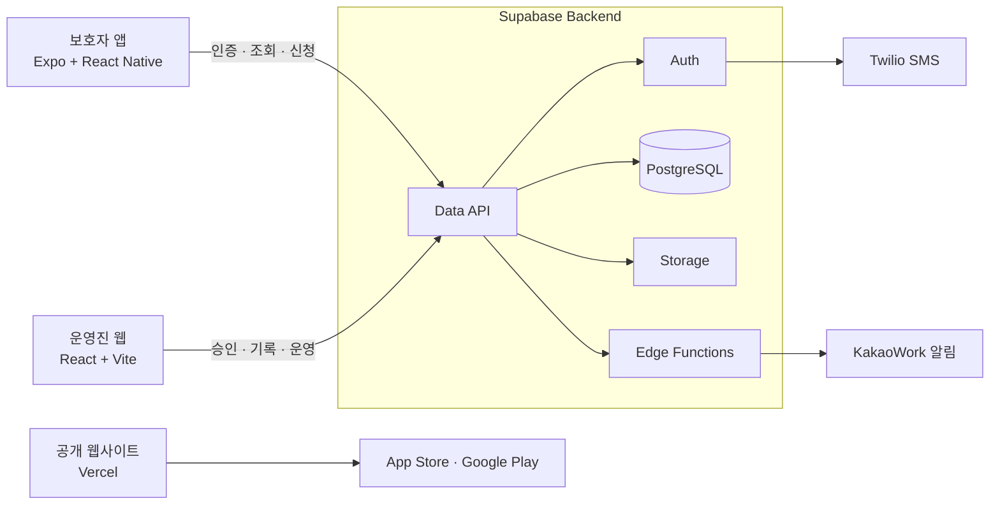

<div align="center">

  

  <h3><big>동네에서 떠나는 세계여행 </big></h3>

  <h3>
    초등학생들의 부족한 국제문화 경험을<br />
    국내 외국인 유학생과의 오프라인 문화체험으로 해결하는 앱
  </h3>

  <p>
    <a href="https://play.google.com/store/apps/details?id=com.globee.parent">
      
    </a>
    &nbsp;&nbsp;&nbsp;&nbsp;&nbsp;&nbsp;&nbsp;&nbsp;
    <a href="https://apps.apple.com/kr/app/globee/id6792293681">
      
    </a>
  </p>

  <table>
    <tr>
      <td align="center">
        <a href="https://play.google.com/store/apps/details?id=com.globee.parent">
          
        </a>
        <br />
        <sub><b>Google Play</b></sub>
      </td>
      <td align="center">
        <a href="https://apps.apple.com/kr/app/globee/id6792293681">
          
        </a>
        <br />
        <sub><b>App Store</b></sub>
      </td>
    </tr>
  </table>

  <br />

  <a href="https://globee.ai.kr/">
    
  </a>

  <h3>
    <a href="https://globee.ai.kr/"><big>공식 웹사이트 방문하기</big></a>
  </h3>

  <p>
    <a href="https://globee-admin.vercel.app/"><b>관리자 페이지</b></a>
  </p>

</div>

---

<div align="center">

  <h3><big> 주요 성과</big></h3>

</div>

<br />
<br />

<p align="center">
  
  &nbsp;&nbsp;
  
  <br />
  
</p>

<br />

<p align="center">
  
  &nbsp;&nbsp;
  
  <br />
  
</p>

###  언론 보도

> [동아일보](https://www.donga.com/news/It/article/all/20260716/134310570/1) · [IT동아](https://it.donga.com/109200/) · [동아 비즈N](https://bizn.donga.com/List/3/all/20260716/134310570/2) · [네이버 블로그](https://blog.naver.com/itdonga_me/224348261820) · [다음뉴스](https://v.daum.net/v/20260716105103066) · [네이트뉴스](https://news.nate.com/view/20260716n12482)

<br />

---

<div align="center">

  <h3><big> 기술 스택</big></h3>

  <p>
    
    
    
    
    
  </p>
  <p>
    
    
    
    
    
  </p>

</div>

| 영역 | 기술 | 적용 범위 |
| :--- | :--- | :--- |
| **Mobile** | Expo, React Native, Expo Router, TypeScript | 보호자 앱, 인증, 신청, 문화 기록, 스탬프 |
| **Admin Web** | React, Vite, TypeScript | 신청 승인, 완료문화·사진 등록, 운영 데이터 관리 |
| **Backend** | Supabase Auth, PostgreSQL, Storage, Realtime, RPC | 인증, 데이터, 이미지 저장, 실시간 동기화 |
| **Serverless** | Supabase Edge Functions, Twilio, KakaoWork | 계정 삭제, SMS 인증, 신규 신청 알림 |
| **Deploy & CI** | Vercel, EAS Build, GitHub Actions | 웹 배포, 모바일 빌드, 자동 품질 검사 |

---

<div align="center">

  <h3><big> 서비스 구조</big></h3>

</div>



---

<div align="center">

  <h3><big> 저장소 구성</big></h3>

</div>

```text
Globee/
├── mobile/       Expo + React Native 보호자 앱
├── admin-web/    React + Vite 운영진 웹
├── web/          서비스 소개, 약관, 개인정보처리방침, 계정 삭제 안내
└── supabase/     SQL 마이그레이션, RLS 정책, Edge Functions
```

### 구현 범위

- 전화번호 인증 기반 회원가입·로그인·비밀번호 재설정
- 비회원 문화교류 탐색과 회원 전용 자녀 등록·신청 흐름
- 신청 확인·승인·취소·완료·미참여 상태 관리
- 완료문화 사진·일지와 국가별 스탬프 기록
- 보호자 필수 동의 및 선택적 활동 사진 동의 관리
- 운영진 대시보드와 신규 신청 KakaoWork 알림
- 앱 내 계정 삭제와 공개 개인정보처리방침·이용약관 제공

---

<div align="center">

  <h3><big> 품질과 보안</big></h3>

</div>

- 모든 공개 데이터 테이블에 Row Level Security 정책 적용
- 서비스 키와 Webhook은 클라이언트가 아닌 서버 환경에서만 관리
- 보호자 동의 상태에 따라 활동 사진 등록과 제공을 제한
- GitHub Actions로 모바일 타입 검사·Lint, 운영진 웹 빌드, 공개 웹 링크를 자동 검증
- 모바일 릴리즈와 웹·백엔드 배포 경로를 분리해 운영 앱의 안정성 보호

<br />

<div align="center">

  <a href="https://github.com/woojeonghyuk/Globee/actions/workflows/ci.yml">
    
  </a>

  <p><b>Globee — 아이의 첫 세계를 연결합니다.</b></p>

</div>
