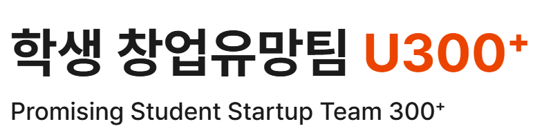

<div align="center">

  

  <h3><big>동네에서 떠나는 세계여행 🌏</big></h3>

  <h3>
    초등학생들의 부족한 국제문화 경험을<br />
    국내 외국인 유학생과의 오프라인 문화체험으로 해결하는 앱
  </h3>

  <p>
    <a href="https://play.google.com/store/apps/details?id=com.globee.parent">
      
    </a>
    &nbsp;&nbsp;&nbsp;&nbsp;&nbsp;&nbsp;&nbsp;&nbsp;
    <a href="https://apps.apple.com/kr/app/globee/id6792293681">
      
    </a>
  </p>

  <table>
    <tr>
      <td align="center">
        <a href="https://play.google.com/store/apps/details?id=com.globee.parent">
          
        </a>
        <br />
        <sub><b>Google Play</b></sub>
      </td>
      <td align="center">
        <a href="https://apps.apple.com/kr/app/globee/id6792293681">
          
        </a>
        <br />
        <sub><b>App Store</b></sub>
      </td>
    </tr>
  </table>

  <br />

  <a href="https://globee.ai.kr/">
    
  </a>

  <h3>
    <a href="https://globee.ai.kr/"><big>공식 웹사이트 방문하기</big></a>
  </h3>

  <p>
    <a href="https://globee-admin.vercel.app/"><b>관리자 페이지</b></a>
  </p>

</div>

---

<div align="center">

  <h3><big> 주요 성과</big></h3>

</div>

<br />
<br />

<p align="center">
  
  &nbsp;&nbsp;
  
  <br />
  
</p>

<br />

<p align="center">
  
  &nbsp;&nbsp;
  
  <br />
  
</p>

### 📰 언론 보도

> [동아일보](https://www.donga.com/news/It/article/all/20260716/134310570/1) · [IT동아](https://it.donga.com/109200/) · [동아 비즈N](https://bizn.donga.com/List/3/all/20260716/134310570/2) · [네이버 블로그](https://blog.naver.com/itdonga_me/224348261820) · [다음뉴스](https://v.daum.net/v/20260716105103066) · [네이트뉴스](https://news.nate.com/view/20260716n12482)

<br />

---


## Project Structure

```text
mobile/      Expo + React Native 학부모 앱
admin-web/   Vite + React 운영진 웹
web/         공개 웹사이트, 개인정보처리방침, 이용약관, 계정 삭제 안내
supabase/    SQL 마이그레이션, RLS 정책, Edge Functions
```

## Main Stack

- Mobile: Expo, React Native, Expo Router
- Admin Web: React, Vite, TypeScript
- Backend: Supabase Auth, PostgreSQL, Storage, Realtime, RPC, Edge Functions
- SMS OTP: Supabase Phone Auth + Twilio
- Operator Alerts: KakaoWork Incoming Webhook through Supabase Edge Functions
- Public/Admin Web Deploy: Vercel
- Mobile Build: EAS Build

## Important URLs

- Public site: `https://globee.ai.kr/`
- Admin web: `https://globee-admin.vercel.app/`
- Supabase project: `https://emuvubzjxdfdonjrabaw.supabase.co`

## Security Notes

- Do not commit `.env`, `.env.local`, service role keys, or secret keys.
- Use `.env.example` files only as key-name references. Never put real values in example files.
- Mobile and admin web may only use Supabase URL and anon/publishable key.
- Supabase service role key is used only inside Edge Functions through Supabase environment variables.
- KakaoWork webhook URLs are stored only as Supabase Secrets.
- Admin web session persistence is disabled, so operators must log in again after closing or refreshing the page.
- Test OTP entries in Supabase Auth should stay empty before production release.

## Environment Files

```text
mobile/.env.local      EXPO_PUBLIC_SUPABASE_URL, EXPO_PUBLIC_SUPABASE_ANON_KEY
admin-web/.env.local   VITE_SUPABASE_URL, VITE_SUPABASE_ANON_KEY
supabase secrets       SUPABASE_SERVICE_ROLE_KEY, KAKAOWORK_WEBHOOK_URL
```

Tracked `.env.example` files document the required key names only. Real values stay in local `.env.local`, EAS environment variables, Vercel environment variables, or Supabase Secrets.

## Common Checks

GitHub에 push하거나 PR을 만들면 GitHub Actions `CI`가 아래 검사를 자동으로 실행합니다.

- 추적되면 안 되는 파일 검사: `.env`, `node_modules`, `.vercel`, `.eas`, `dist`, `build`
- 모바일 앱: TypeScript 타입체크, ESLint
- 운영진 웹: production build
- 공개 웹사이트: 로컬 링크와 이미지 참조 확인

로컬에서 직접 확인할 때는 아래 명령을 사용합니다.

```bash
cd mobile
npx.cmd tsc --noEmit
npm.cmd run lint
```

```bash
cd admin-web
npx.cmd tsc --noEmit
```

운영진 웹의 실제 릴리즈 출력까지 확인해야 할 때만 빌드를 실행합니다.

```bash
cd admin-web
npm.cmd run build
```

공개 웹사이트는 정적 HTML/CSS라 별도 빌드가 없습니다. 링크와 이미지 참조는 GitHub Actions에서 확인합니다.

## Launch Flow

1. Apply new SQL files in `supabase/sql` through Supabase SQL Editor.
2. Deploy changed Edge Functions.
3. Push code to GitHub so Vercel redeploys `web` and `admin-web`.
4. Confirm GitHub Actions `CI` passed on GitHub.
5. Build Android preview APK with EAS and test on a real Android device.
6. Build production AAB and submit through Google Play Console.

## Release Discipline

- 운영진 웹과 공개 웹사이트는 GitHub `main`에 push하면 Vercel이 자동 배포합니다.
- 모바일 앱은 Google Play에 올라가는 릴리즈이므로 자동 배포하지 않고, EAS production build를 수동으로 실행합니다.
- 출시된 모바일 앱의 문구, 디자인, JavaScript 수정은 EAS Update의 `preview` 채널에서 먼저 확인한 뒤 `production` 채널로 배포합니다.
- 앱 아이콘, 네이티브 스플래시, 권한, native library 변경은 OTA로 확인할 수 없으므로 새 APK/AAB 빌드가 필요합니다.
- Supabase SQL과 Edge Functions는 자동 적용하지 않습니다. DB 변경은 SQL Editor에서 실행하고, 함수 변경은 Supabase CLI로 배포한 뒤 테스트합니다.
- 새 기능을 넣을 때는 `mobile`, `admin-web`, `supabase`, `web` 중 영향을 받는 폴더의 README도 함께 갱신합니다.
